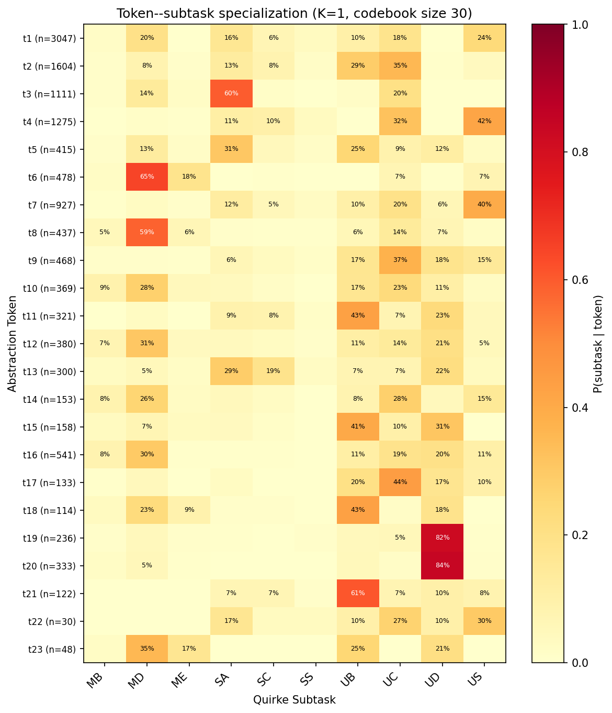

# Token-Subtask Heatmap

**Model:** `add_sub_sorl_v1_abs30_K1_100K` (K=1, abs_vocab=30)
**Eval set:** canonical N=100 from HuggingFace
**Examples processed:** 2600

## Token Summary

| Token | Count | Top Subtask | % | Top Carry | % |
|-------|-------|-------------|---|-----------|---|
| t1 | 3916 | SA=26% | | no_carry=66% | |
| t2 | 1517 | UC=28% | | no_carry=63% | |
| t3 | 1108 | UB=35% | | no_carry=78% | |
| t5 | 862 | UB=21% | | no_carry=61% | |
| t6 | 714 | US=48% | | no_carry=90% | |
| t7 | 526 | UB=47% | | no_carry=52% | |
| t8 | 531 | UC=42% | | carry=51% | |
| t9 | 299 | UC=42% | | no_carry=78% | |
| t11 | 332 | MD=53% | | carry=62% | |
| t13 | 284 | UC=45% | | carry=59% | |
| t14 | 707 | UD=65% | | no_carry=61% | |
| t15 | 245 | UB=24% | | no_carry=68% | |
| t16 | 635 | MD=32% | | carry=65% | |
| t18 | 212 | UC=31% | | no_carry=60% | |
| t20 | 221 | SA=32% | | no_carry=67% | |
| t21 | 368 | US=92% | | no_carry=95% | |
| t22 | 158 | UC=41% | | carry=64% | |
| t23 | 365 | UD=83% | | no_carry=54% | |
